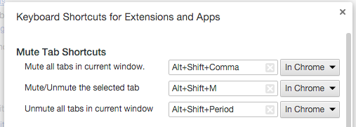
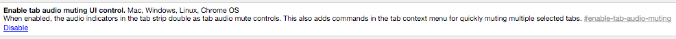

#  Chrome Mute tabs

> Quickly mute tabs with keyboard shortcuts.

## Install

- [Chrome Webstore](https://chrome.google.com/webstore/detail/mute-tab-shortcuts/opcjanmpjbdbdpnjfjbboacibokblbhl)

In order for the extension to function properly (as of Chrome 45), you need to enable the "Enable tab audio muting UI control" in [chrome://flags](chrome://flags)

## Liscence
MIT © [Daniel Pham](https://phamdaniel.github.io)
