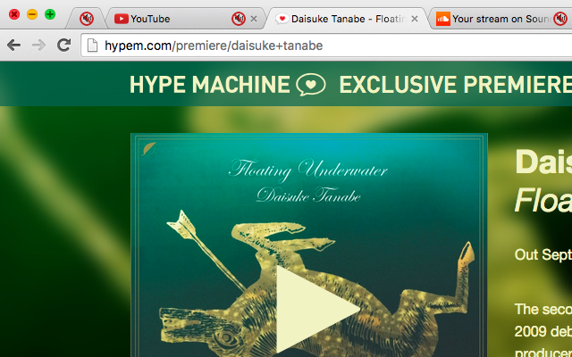

#  Chrome Mute tabs

You have music playing in one tab. You open another website that also plays music. You don't have to listen this awful mix anymore, since you can mute tabs with shortcuts. And unmute them back too!

## Install

1. Install the extension from [Chrome Webstore](https://chrome.google.com/webstore/detail/mute-tab-shortcuts/opcjanmpjbdbdpnjfjbboacibokblbhl)
2. Enable the "Tab audio muting UI control" in [chrome://flags](chrome://flags). Extension uses this experimental feature (as of Chrome 51).

## Licence

MIT © [Daniel Pham](https://phamdaniel.github.io)
